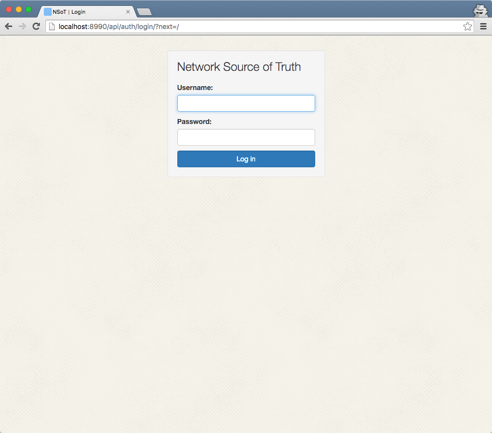

#############
NSoT Demo app
#############

This is a basic server instance with a single Site full of dummy Networks,
Devices, and Attributes you can use to experiment.

Running the demo
================

To try out the demo, make sure you've already installed NSoT. If it's
installed in a Python virtualenv, make sure that it is activated.

Run the demo::

    $ ./run_demo.sh

This script will:

* Set environment variable ``NSOT_CONF=./demo_settings.py`` to tell NSoT to
  read the config from there.
* Create a demo SQLite database at ``demo.sqlite3``
* Load the test fixtures from ``demo_fixtures.json.gz``
* Start up the web service on ``8990/tcp``

If you encounter an issue
-------------------------

* Have you run the demo previously? Try deleting ``demo.sqlite3`` and starting
  over!

Explore
=======

Once it's running, point your browser to http://localhost:8990/ 

You'll be prompted for a username/password

Username
    admin@localhost

Password
    admin

**Note:** If NSoT isn't installed on ``localhost``, substitute the IP or
hostname where it is installed.

Screenshot:

CLI
---

The CLI utility is maintained in a separate project called pynsot. Read more
about it at https://pynsot.readthedocs.io.

You may install it by running::

    $ pip install pynsot

You may use it by running::

    $ nsot

API
---

The Browsable API can be found at http://localhost:8990/api/

Docs
----

The interactive API explorer can be found at http://localhost:8990/docs/
