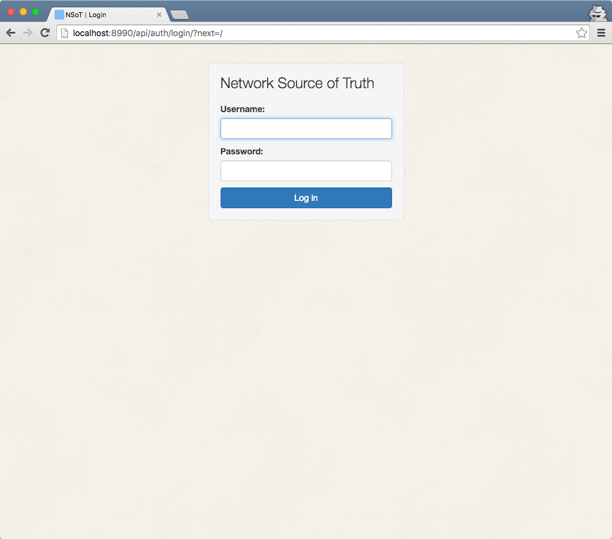

###########
Quick Start
###########

Network Source of Truth is super easy to get running. If you just can't wait to
skip ahead, this guide is for you.

.. note::
    This quick start assumes a lot. If it doesn't work for you, please skip
    this and read the :doc:`installation` guide.

1. Install NSoT:

   .. code-block:: bash

       $ pip install nsot

2. Initialize the config (this will create a default config in
   ``~/.nsot/nsot.conf.py``):

   .. code-block:: bash

       $ nsot-server init

3. Start the server on ``8990/tcp`` (the default) and create a superuser
   when prompted:

   .. code-block:: bash

       $ nsot-server start

4. Now fire up your browser and visit http://localhost:8990!

5. Use the username/password created in step 3 to login.

Now, head over to the :doc:`tutorial` to start getting acquainted with NSoT!
